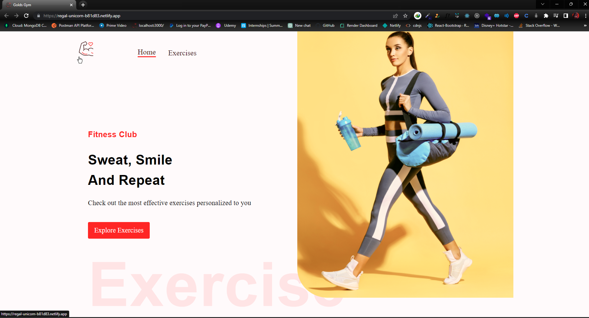
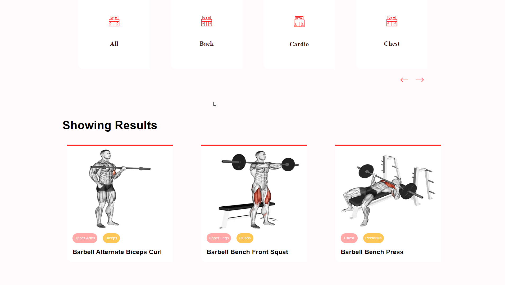
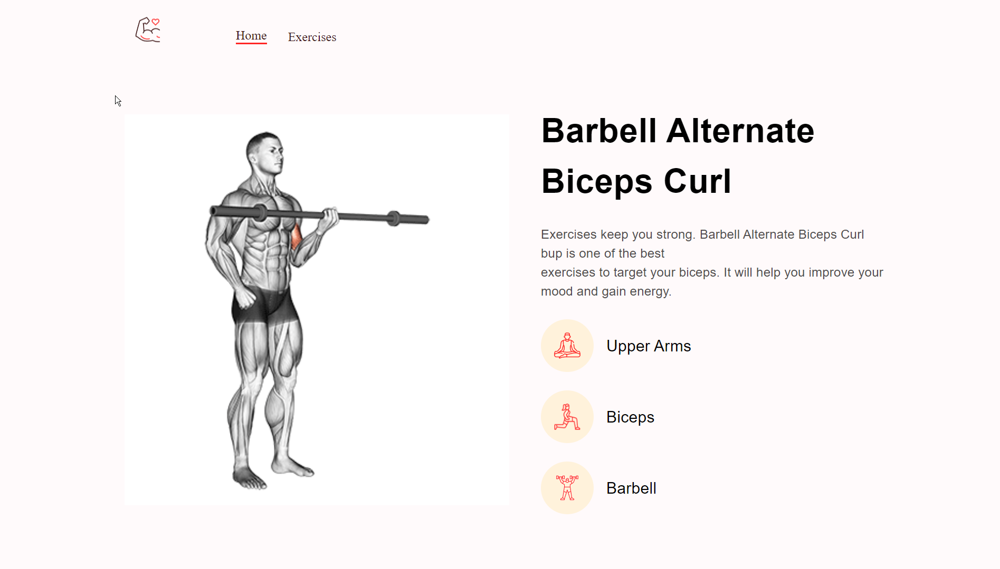
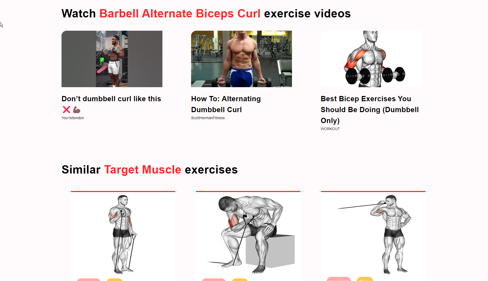
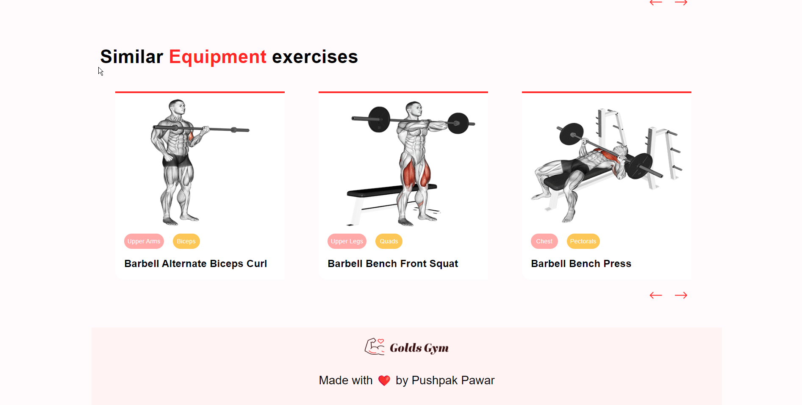

# React Fitness Application

React Fitness Application to search exercises according to body part and exercise name and also help to perform through Youtube videos..

Main Highlights: Material UI, React File Structure, RapidAPI

### DEMO
https://regal-unicorn-b81d83.netlify.app/

## Available Scripts

### Install Dependencies

Install dependencies 

### `npm install`

In the project directory, you can run:

### `npm start`

Runs the app in the development mode.\
Open [http://localhost:3000](http://localhost:3000) to view it in your browser.

